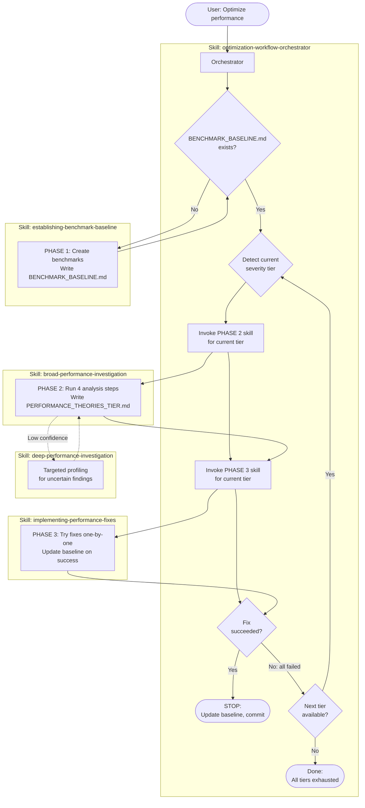
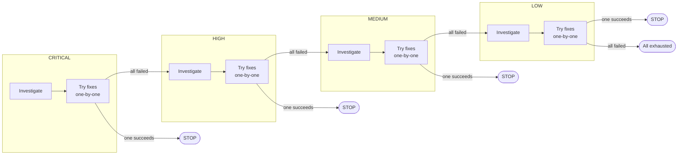
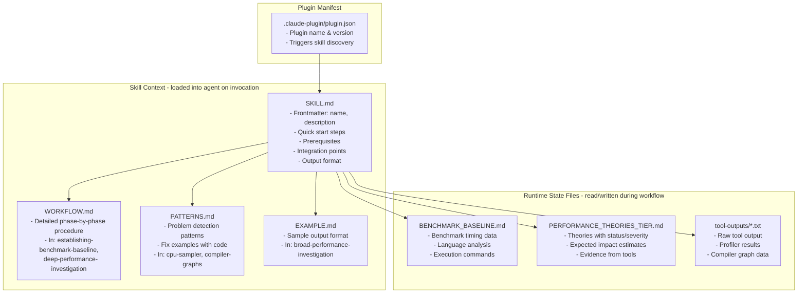
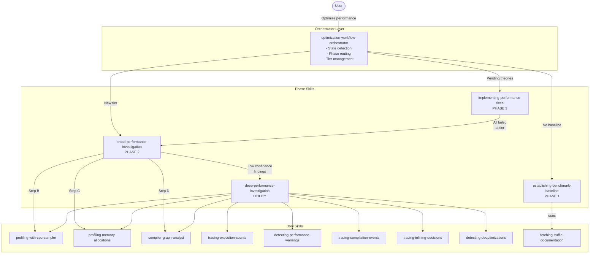

# Architecture Documentation: `main` Branch

## 1. Process Run with the Orchestrator

The `main` branch implements a **3-phase optimization loop with severity-tiered iteration**. The orchestrator manages state transitions by checking which files exist on disk.

### Workflow Overview

### Severity-Tiered Iteration Detail

### State Detection Logic

The orchestrator determines the current phase by checking files on disk:

1. `BENCHMARK_BASELINE.md` missing -> Phase 1
2. Check `PERFORMANCE_THEORIES_{TIER}.md` files for pending theories -> Phase 3
3. Determine next uninvestigated tier -> Phase 2
4. All tiers complete -> Terminate

### Phase Details

| Phase | Skill | Entry Condition | Output |
|-------|-------|----------------|--------|
| 1 | `establishing-benchmark-baseline` | No `BENCHMARK_BASELINE.md` | `BENCHMARK_BASELINE.md`, benchmark files |
| 2 | `broad-performance-investigation` | Starting new severity tier | `PERFORMANCE_THEORIES_{TIER}.md` |
| 3 | `implementing-performance-fixes` | Theories with `pending` status exist | Updated code, updated baseline |

---

## 2. How AI Context Is Used

The `main` branch uses a **multi-layered context system** where different files provide different scopes of guidance to Claude.

### Context Layers

| Layer | File(s) | Loaded When | Purpose |
|-------|---------|------------|---------|
| Plugin | `plugin.json` | Plugin load via `--plugin-dir` | Skill discovery and registration |
| Skill | `skills/*/SKILL.md` | When skill is model-invoked | Specific procedures, tool options, output format |
| Skill Support | `WORKFLOW.md`, `PATTERNS.md`, `EXAMPLE.md` | Referenced from SKILL.md | Detailed procedures, pattern catalogs, sample outputs |
| Runtime | `BENCHMARK_BASELINE.md`, `PERFORMANCE_THEORIES_*.md` | During workflow execution | State tracking, data exchange between phases |
| Tool Output | `tool-outputs/*.txt` | After tool execution | Raw profiling data for analysis |

### Context Size (main branch)

The `main` branch has **substantial context** per skill:

| Skill | Files | Approx. Context |
|-------|-------|-----------------|
| `optimization-workflow-orchestrator` | SKILL.md (204 lines) | Large: full state machine, tier logic, mermaid diagrams |
| `establishing-benchmark-baseline` | SKILL.md + WORKFLOW.md + EXAMPLES.md | Very large: 5-phase procedure with detailed instructions |
| `broad-performance-investigation` | SKILL.md + EXAMPLE.md (232 lines) | Large: 4-step analysis, theory structure, severity tiers |
| `implementing-performance-fixes` | SKILL.md (162 lines) | Large: fix workflow, status tracking, tier transitions |
| `deep-performance-investigation` | SKILL.md + WORKFLOW.md (257 lines) | Large: targeted profiling, impact estimation |
| Tool skills (7 skills) | SKILL.md + optional PATTERNS.md/QUERIES.md/DUMPING.md | Medium: tool options, output interpretation |

---

## 3. Agent/Skill Call Hierarchy

### Call Hierarchy Table

| Caller | Calls | Mechanism | When |
|--------|-------|-----------|------|
| `optimization-workflow-orchestrator` | `establishing-benchmark-baseline` | Direct invocation (skill) | No baseline exists |
| `optimization-workflow-orchestrator` | `broad-performance-investigation` | Direct invocation (skill) | Starting new severity tier |
| `optimization-workflow-orchestrator` | `implementing-performance-fixes` | Direct invocation (skill) | Pending theories exist |
| `broad-performance-investigation` | `profiling-with-cpu-sampler` | Tool skill invocation | Step B (mandatory) |
| `broad-performance-investigation` | `profiling-memory-allocations` | Tool skill invocation | Step C (mandatory) |
| `broad-performance-investigation` | `compiler-graph-analyst` | Subagent spawn | Step D (mandatory) |
| `broad-performance-investigation` | `deep-performance-investigation` | Skill invocation | Low-confidence findings |
| `deep-performance-investigation` | All 8 tool skills | Tool skill invocation | Targeted profiling |
| `implementing-performance-fixes` | `broad-performance-investigation` | Triggers next phase | All theories at tier failed |

### Key Architectural Properties

- **14 skills total**: 1 orchestrator + 3 phase skills + 1 utility skill + 8 tool skills + 1 docs skill
- **All skills are model-invoked** (Claude selects based on context, not user commands)
- **State managed via files**: `BENCHMARK_BASELINE.md`, `PERFORMANCE_THEORIES_{TIER}.md`
- **4 theory files** (one per severity tier, never deleted)
- **File-based state machine**: Orchestrator checks file existence and content to determine next action
