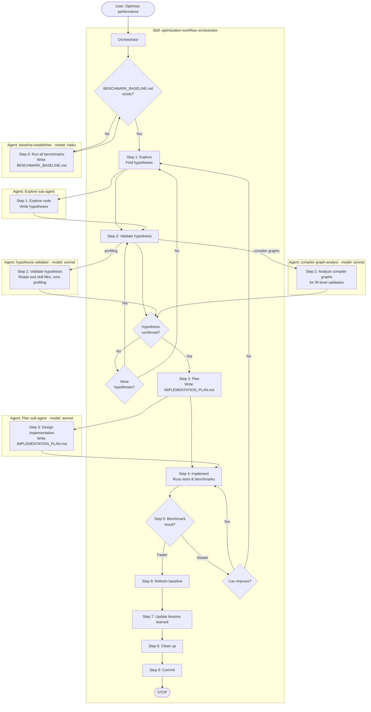
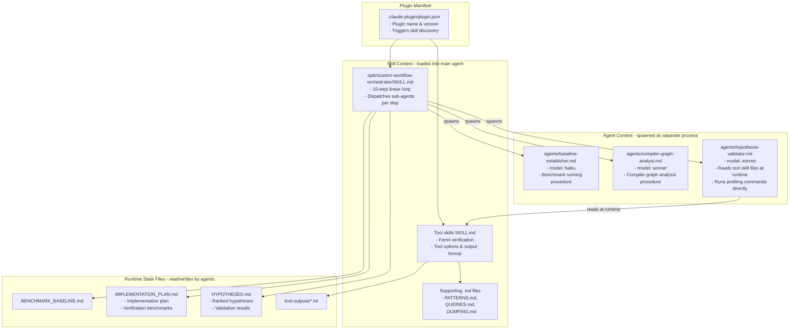
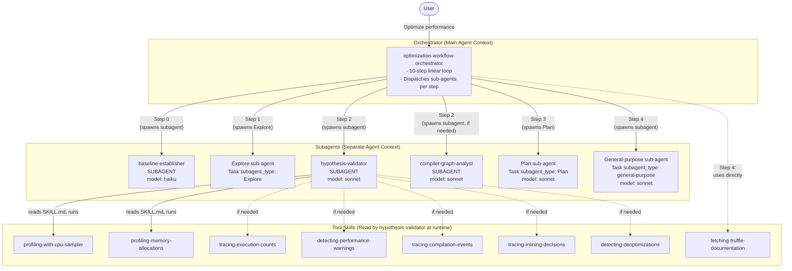

# Architecture Documentation: `slim-process` Branch

## 1. Process Run with the Orchestrator

The `slim-process` branch implements a **simplified optimization loop** without severity tiers. The orchestrator runs steps sequentially, looping back on failure.

### Workflow Overview

### Step Details

| Step | Actor | Input | Output |
|------|-------|-------|--------|
| 0 | `baseline-establisher` subagent (Haiku) | Project code | `BENCHMARK_BASELINE.md` |
| 1 | Explore sub-agent | Language code + baseline + lessons | `HYPOTHESES.md` |
| 2 | `hypothesis-validator` subagent (Sonnet) or `compiler-graph-analyst` subagent | `HYPOTHESES.md` | Updated `HYPOTHESES.md` (confirmed/rejected) |
| 3 | Plan sub-agent (Sonnet) | Confirmed hypothesis + baseline | `IMPLEMENTATION_PLAN.md` |
| 4 | General-purpose sub-agent (Sonnet) | `IMPLEMENTATION_PLAN.md` | Code changes, benchmark results |
| 5-9 | Orchestrator (main agent) | Results | Validate, refresh baseline, lessons, clean up, commit |

---

## 2. How AI Context Is Used

The `slim-process` branch uses a **streamlined context system** with fewer files. Each step of the optimization loop is dispatched by the orchestrator to a purpose-built sub-agent. All sub-agents run in separate agent contexts.

### Context Layers

| Layer | File(s) | Loaded When | Purpose |
|-------|---------|------------|---------|
| Plugin | `plugin.json` | Plugin load via `--plugin-dir` | Skill and agent discovery |
| Skill | `skills/*/SKILL.md` + support files | When skill is model-invoked | Procedures, tool options, output format |
| Agent | `agents/*.md` | When subagent is spawned | Self-contained procedure for the subagent |
| Runtime | `BENCHMARK_BASELINE.md`, `IMPLEMENTATION_PLAN.md`, `HYPOTHESES.md` | During workflow execution | State tracking, data exchange between steps |

### Context Size Comparison

| Component | `main` | `slim-process` | Change |
|-----------|--------|----------------|--------|
| Orchestrator SKILL.md | 204 lines | ~100 lines | -51% |
| Phase/workflow skills | 3 skills (698 lines total) | Removed | -100% |
| Subagent definitions | None | 3 agents (baseline + compiler-graph + hypothesis-validator) | New |
| Tool skills | 8 skills (unchanged) | 8 skills (minor edits) | ~same |
| `deep-performance-investigation` | 1 skill (116 + 141 lines) | Removed | -100% |
| **Total plugin context** | **~2400 lines** | **~1100 lines** | **~-54%** |

---

## 3. Agent/Skill Call Hierarchy

### Call Hierarchy Table

| Caller | Calls | Mechanism | When |
|--------|-------|-----------|------|
| `optimization-workflow-orchestrator` | `baseline-establisher` | **Subagent spawn** (Haiku) | Step 0: no baseline exists |
| `optimization-workflow-orchestrator` | Explore sub-agent | **Task** (subagent_type: Explore) | Step 1: explore for hypotheses |
| `optimization-workflow-orchestrator` | `hypothesis-validator` | **Subagent spawn** (Sonnet) | Step 2: validate with profiling tools |
| `optimization-workflow-orchestrator` | `compiler-graph-analyst` | **Subagent spawn** (Sonnet) | Step 2: validate with compiler graphs (conditional) |
| `optimization-workflow-orchestrator` | Plan sub-agent | **Task** (subagent_type: Plan, Sonnet) | Step 3: design implementation plan |
| `optimization-workflow-orchestrator` | General-purpose sub-agent | **Task** (subagent_type: general-purpose, Sonnet) | Step 4: implement the plan |
| `optimization-workflow-orchestrator` | (self) | Direct execution | Steps 5-9: validate, refresh, lessons, clean up, commit |
| `hypothesis-validator` subagent | Tool skill SKILL.md files | **File read** (reads at runtime) | Understands tool options and runs commands |

### Key Architectural Properties

- **All sub-agents run in separate contexts**: no agent invokes skills or spawns other agents
- **3 agent definitions** in `agents/` directory (baseline-establisher, compiler-graph-analyst, hypothesis-validator)
- **hypothesis-validator reads tool skill files at runtime**: it reads SKILL.md to learn command format, then runs profiling commands directly
- **State managed via files**: `BENCHMARK_BASELINE.md`, `IMPLEMENTATION_PLAN.md`, `HYPOTHESES.md`
- **No severity tiers** — single iteration loop
- **10-step linear workflow**: each step dispatches one sub-agent or runs directly
